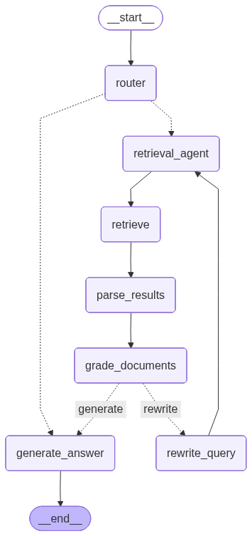

<div align="center">
  <h1>Documind</h1>
  <p><strong>Production-minded, agentic RAG for reliable question-answering over private documents.</strong></p>
</div>

## What This Project Demonstrates

Documind is a full-stack AI system that ingests enterprise-style documents and answers questions using an adaptive retrieval workflow. It is built to show practical engineering depth, not just a demo chat UI.

For recruiters and startup founders, this repo demonstrates:

- end-to-end product ownership (frontend + backend + infra-style concerns),
- agentic RAG architecture with self-correction,
- security-aware prompting (prompt injection guardrails),
- measurable quality loops (RAGAS evaluation),
- observability for debugging and iteration (Arize Phoenix + OpenTelemetry),
- real-world platform decisions under constraints (Windows compatibility, local embeddings, vector DB trade-offs).

---

## Architecture Diagram



### High-Level Flow

1. User uploads a document (`/api/upload-document`).
2. Backend parses/chunks with Docling + HybridChunker.
3. Chunks are embedded with local ONNX embeddings and stored in Chroma.
4. User asks a question (`/api/chat`).
5. LangGraph orchestrator routes through retrieve -> grade -> rewrite (if needed) -> answer.
6. RAGAS evaluation runs in background for quality tracking.
7. Phoenix traces the pipeline for observability.

---

## Core Features (Implemented)

### 1) Agentic, Self-Correcting RAG Workflow

The QA pipeline is not a single retrieve-and-generate call. It is a graph:

- `generate_query_or_respond`: model decides whether retrieval is needed,
- `retrieve`: tool call to a hybrid retriever,
- `grade_documents`: checks retrieval relevance,
- `rewrite_question`: rewrites weak queries and loops back,
- `generate_answer`: creates final grounded response.

This gives controlled adaptation when first-pass retrieval is weak.

### 2) Prompt Injection Guardrails

Guardrails are explicitly embedded in prompts for both grading and answering:

- retrieved context is marked as **UNTRUSTED**,
- model is told to ignore any instructions inside context,
- model is constrained to relevance-checking or factual extraction only.

This protects against malicious instructions buried in uploaded files.

### 3) Hybrid Retriever (Semantic + Keyword)

Retrieval combines:

- dense vector search via Chroma + ONNX embeddings,
- sparse keyword search via BM25,
- weighted ensemble (0.7 dense, 0.3 BM25).

Why it matters: semantic retrieval catches meaning; BM25 catches exact terms/entities. Ensemble retrieval is more robust than either alone.

### 4) Local ONNX Embeddings

Embeddings run from a local ONNX model for predictable inference and lower vendor lock-in at retrieval time.

### 5) RAGAS Quality Check

Each chat request schedules a background evaluation using:

- `AgentGoalAccuracyWithReference`,
- LangGraph-to-RAGAS message conversion,
- async scoring pipeline.

This creates a measurable feedback loop for answer quality.

### 6) Arize Phoenix Observability

The app is instrumented with Phoenix OpenTelemetry registration in backend startup:

- traces capture agent execution paths,
- helps debug routing/retrieval behavior,
- supports iteration with visibility instead of guesswork.

### 7) Full-Stack Product UX

Frontend includes:

- drag-and-drop file upload,
- ingestion state feedback,
- document-aware chat gating (forces upload before querying),
- markdown response rendering,
- responsive sidebar/chat experience.

---

## Why This Is Hard

Building a reliable RAG product is hard because you are solving multiple systems problems at once:

- **Retrieval quality is non-deterministic**: a single bad query can return weak context and collapse answer quality.
- **Documents are messy**: real PDFs contain structural metadata that many vector stores cannot ingest directly.
- **Security is subtle**: retrieved text can contain adversarial instructions that hijack generation.
- **Infra is platform-dependent**: Windows filesystem behavior and vector DB packaging constraints can break "standard" setups.
- **LLM apps need observability**: without tracing/evals, failures feel random and are difficult to improve.

Documind addresses these with explicit architecture, not one-off patches.

---

## Key Engineering Decisions (And Why)

### Decision 1: LangGraph state machine over linear chains
- **Why:** Needed explicit control over branching, looping, and deterministic node transitions.
- **Impact:** Enables self-correction and explainable execution flow.

### Decision 2: Hybrid retriever over pure vector search
- **Why:** Dense retrieval misses exact keywords in some cases; BM25 misses semantic paraphrases.
- **Impact:** Better recall across varied query styles.

### Decision 3: ChromaDB over Milvus-lite for local Windows dev
- **Why:** Milvus-lite support is not Windows-friendly in this setup.
- **Impact:** Preserved local persistent vector storage without Docker dependency.

### Decision 4: Filter complex metadata before indexing
- **Why:** Docling outputs nested metadata that Chroma rejects.
- **Impact:** Prevented ingestion failures while retaining useful searchable content.

### Decision 5: Explicit anti-injection prompt constraints
- **Why:** Retrieved context is untrusted and can contain malicious prompt instructions.
- **Impact:** Improves safety posture during grading and answering.

### Decision 6: Background RAGAS evaluation
- **Why:** Quality must be measured continuously without blocking user latency.
- **Impact:** Practical signal for iterative improvement.

### Decision 7: Phoenix OTEL instrumentation
- **Why:** Agentic systems need trace-level visibility to debug routing and retrieval behavior.
- **Impact:** Faster diagnosis and safer production iteration.

---

## Tech Stack

- **Frontend:** React 19, Vite, Lucide, React Markdown
- **Backend:** FastAPI, Python
- **Agent Orchestration:** LangGraph, LangChain
- **LLM Serving:** Groq-hosted models (for response + grading)
- **Embeddings:** Local ONNX Runtime + Transformers tokenizer
- **Document Parsing/Chunking:** Docling + HybridChunker
- **Retrieval:** Chroma vector search + BM25 + EnsembleRetriever
- **Evaluation:** RAGAS
- **Observability:** Arize Phoenix + OpenTelemetry

---

## Repository Structure

```text
Documind/
├─ docs/
│  └─ agent_architecture.png
├─ frontend/
│  └─ src/
│     ├─ App.jsx
│     └─ components/
└─ server/
   ├─ requirements.txt
   └─ src/
      ├─ main.py
      ├─ routes/api.py
      ├─ agents/qa_agent/
      └─ utils/
```

---

## API Surface

- `POST /api/upload-document`  
  multipart upload; ingests and indexes a single document.

- `POST /api/chat?query=...`  
  runs agentic retrieval workflow and returns model response.

---

## Local Setup

### Prerequisites

- Python 3.10+
- Node.js 18+

### 1) Backend

```bash
cd server
python -m venv .venv
# Windows: .venv\Scripts\activate
# macOS/Linux: source .venv/bin/activate
pip install -r requirements.txt
```

Create `server/.env` with:

```env
NVIDIA_API_KEY=your_key
GROQ_API_KEY=your_key
PHOENIX_API_KEY=your_key
PHOENIX_COLLECTOR_ENDPOINT=your_phoenix_endpoint
```

Run backend:

```bash
uvicorn src.main:app --reload --port 8000
```

### 2) Frontend

```bash
cd frontend
npm install
npm run dev
```

Open `http://localhost:5173`.

---

## Troubleshooting and Operational Notes

Known platform and ingestion issues are documented in `TROUBLESHOOTING.md`, including:

- tokenizer max token context mismatch,
- Hugging Face symlink privilege issues on Windows,
- Milvus-lite compatibility constraints,
- Chroma metadata schema limits.

---

## What a CTO Can Assess from This Repo

- Can this engineer design beyond happy-path demos? **Yes**: graph orchestration, fallback loops, eval, tracing.
- Can they make trade-offs under platform constraints? **Yes**: Windows symlink fallback and vector DB migration.
- Do they think about reliability and safety? **Yes**: guardrails, relevance grading, background quality checks.
- Can they ship product-facing UX with technical depth? **Yes**: complete upload-to-answer user flow.

---

## Next Improvements

- multi-document corpus management instead of reset-on-upload,
- citation spans and source highlighting in UI,
- auth + tenant isolation,
- automated regression datasets for eval baselines,
- containerized deployment profiles.
